# 🧭 Founder OS

> Fifteen business domains, one cockpit. Playbooks you run, systems you install, and structured
> learning that actually goes deep - with **no account, no backend, and nothing phoning home**.

**[▶ Open the live app](https://vdapp32-founder-os.vercel.app)** - no signup, no keys, nothing to configure. It is a static site; you are just reading it.

```bash
git clone https://github.com/BrysonW24/vdapp32-founder-os.git
cd vdapp32-founder-os
npm install && npm run dev
```

Open <http://localhost:3000> and you have the whole thing. 🎉

<p align="center">
  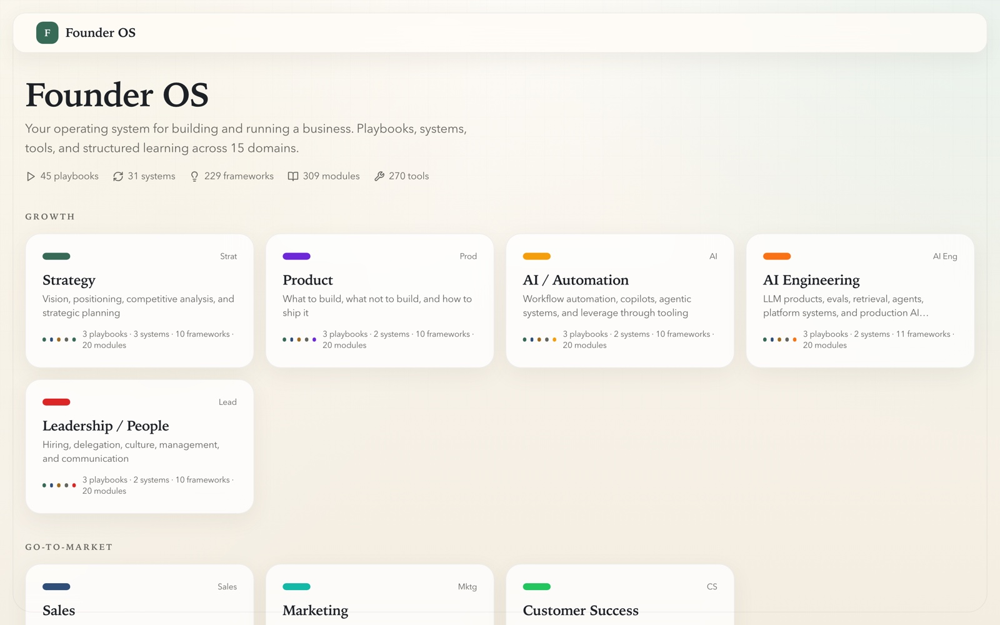
</p>

---

## 🤔 Why this exists

Most business "learning" is either a course you finish and forget, or a blog post that tells you
what to think and never what to do on Monday. Founder OS is built the other way around: **the unit
of value is a thing you run**, not a thing you watch.

Every domain gives you four surfaces on the same subject:

| Surface | What it is | What it answers |
|---|---|---|
| 📘 **Learn** | Modules and lessons with quizzes and completion tracking | "I don't understand this yet" |
| ▶️ **Playbooks** | Step-by-step processes, each step timed and actionable | "I need to do this **today**" |
| 🔄 **Systems** | Repeatable operating cadences you install once | "I want this to keep happening without me" |
| 🔧 **Tools** | Curated tool explorer, scoped to the domain | "What should I actually use?" |

Plus per-domain **projects**, **frameworks and mental models**, **day-in-the-life** scenarios, and
manifest-driven deep dives.

## 📊 What is actually in here

Counted from disk, not estimated. The app computes these same numbers from the content tree at
build time, so the [live dashboard](https://vdapp32-founder-os.vercel.app) and this table cannot
drift apart.

| | | | |
|---|---|---|---|
| **15** domains | **1,468** content files | **334** lessons | **309** modules |
| **270** tools | **229** frameworks | **150** projects | **60** day-in-the-life scenarios |
| **45** playbooks | **31** systems | **206** deep-dive pages | **0** backend services |

That content compiles to **1,497 prerendered HTML pages** - counted from `.next/server/app` after a
real `npm run build` on 2026-07-19, not quoted from an older note. Every one is static: there is no
server rendering a page for you at request time.

**The four groups:**

- **Go-to-Market** - Marketing, Sales, Customer Success
- **Operations** - Finance, Accounting, Operations, Data & Analytics
- **Growth** - Strategy, Product, AI / Automation, AI Engineering, Leadership
- **Founder** - Capital, Legal, Founder Performance

Depth is deliberately uneven and the UI says so. Marketing (26 modules), Sales (47 lessons, 81
frameworks) and AI Engineering (30 tools) run deepest; the other twelve carry a consistent
baseline of 20 modules, 20 lessons, 10 frameworks, 10 projects and 15 tools each. Cards render a
real three-state signal - full content, operating rhythm ready, or coming soon - rather than
pretending everything is finished.

## 📸 The surfaces

### Domain homes

Each domain opens as a narrative academy home with its own visual system, not a table of contents.

<p align="center">
  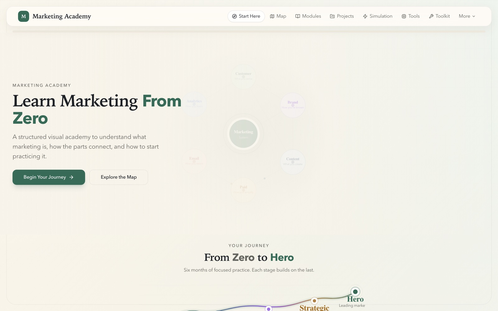
  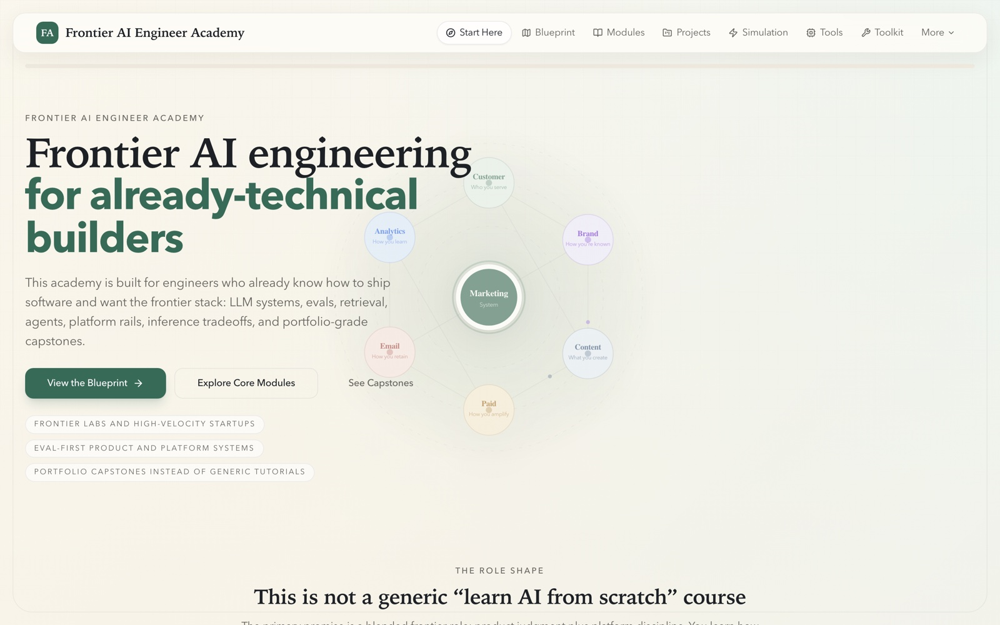
</p>
<p align="center">
  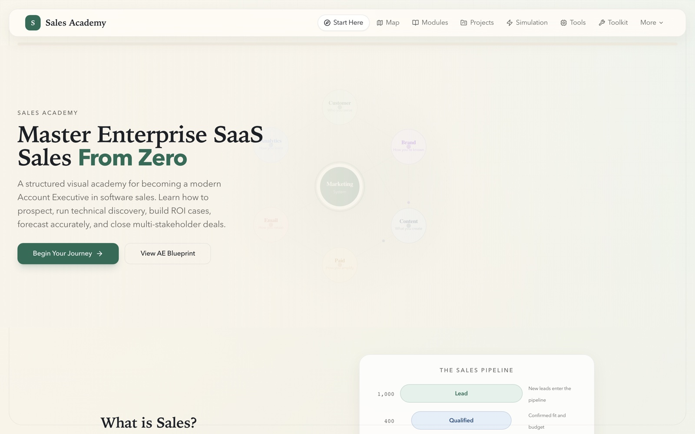
  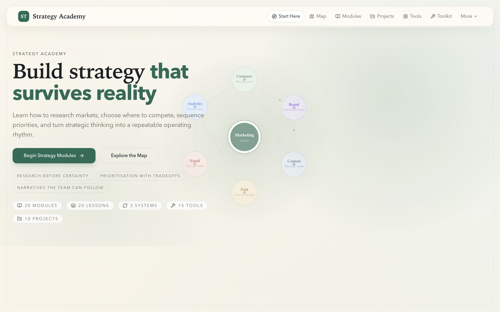
  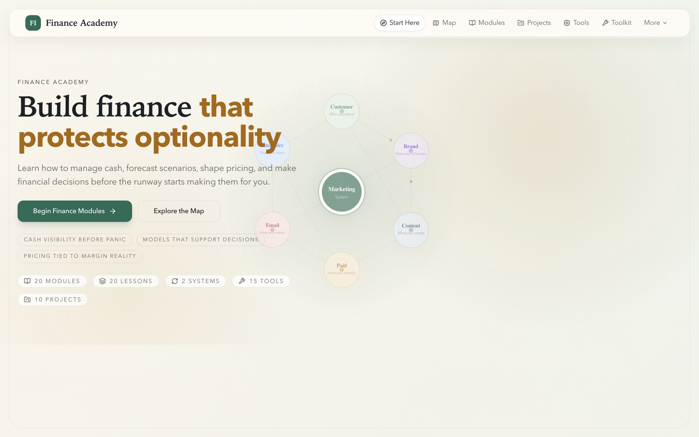
</p>

### Run something: playbooks, systems, tools

<p align="center">
  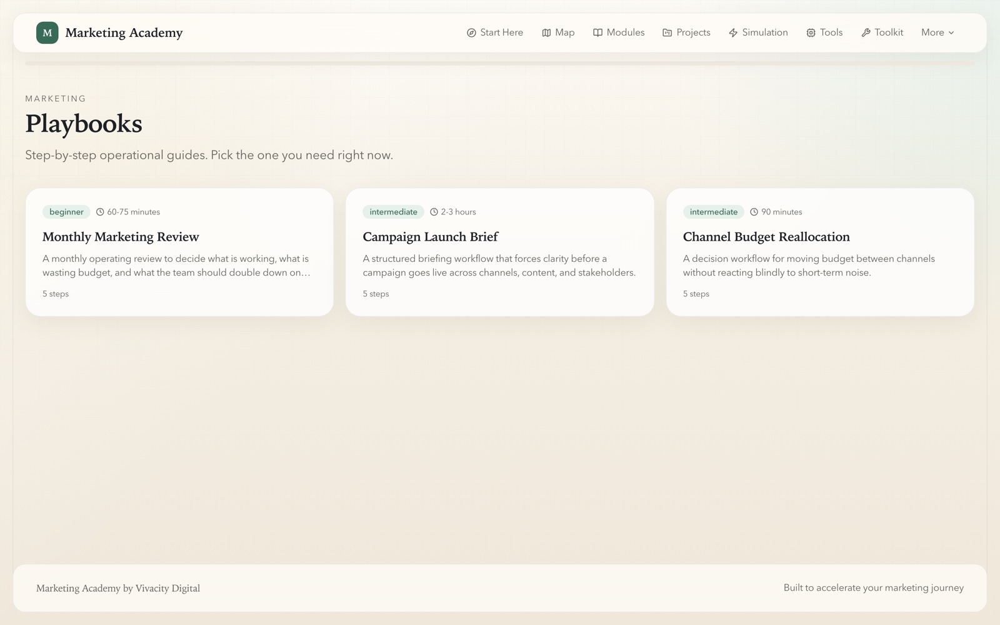
  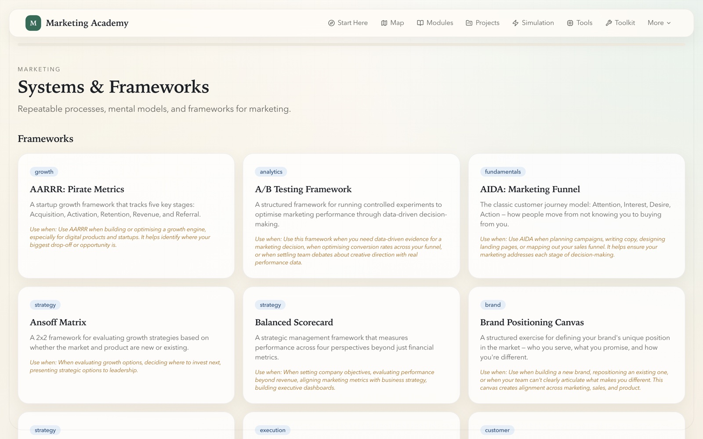
  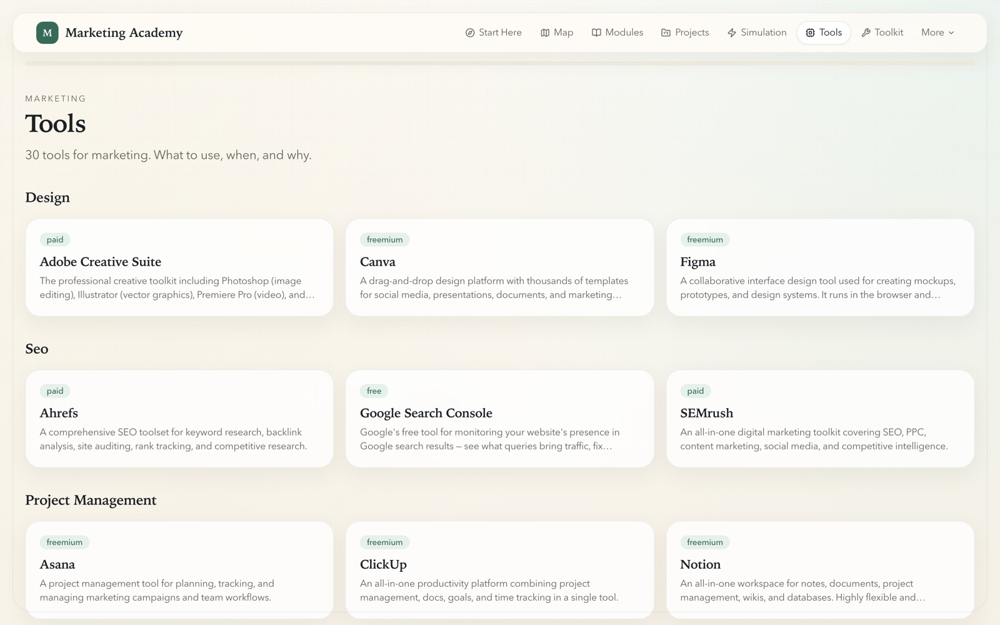
</p>

### Learn something: modules, blueprint, toolkit, projects

<p align="center">
  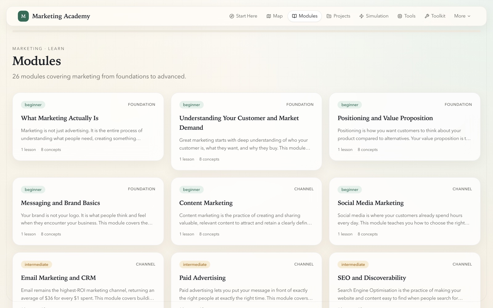
  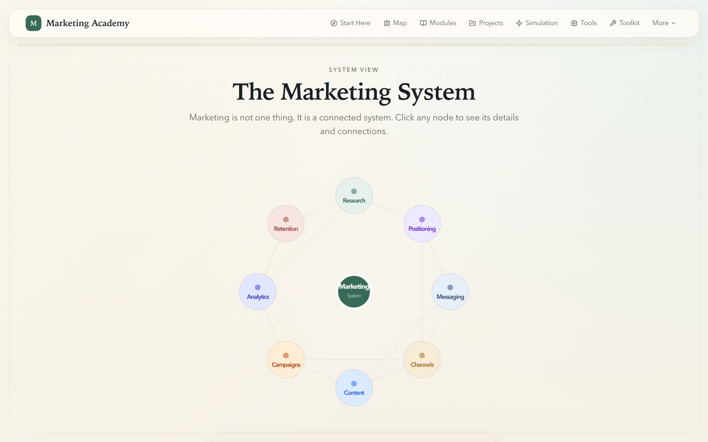
</p>
<p align="center">
  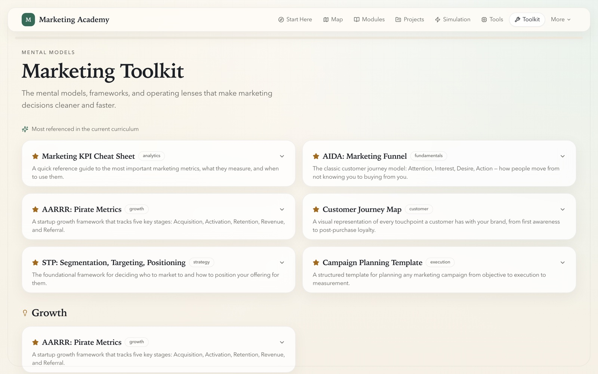
  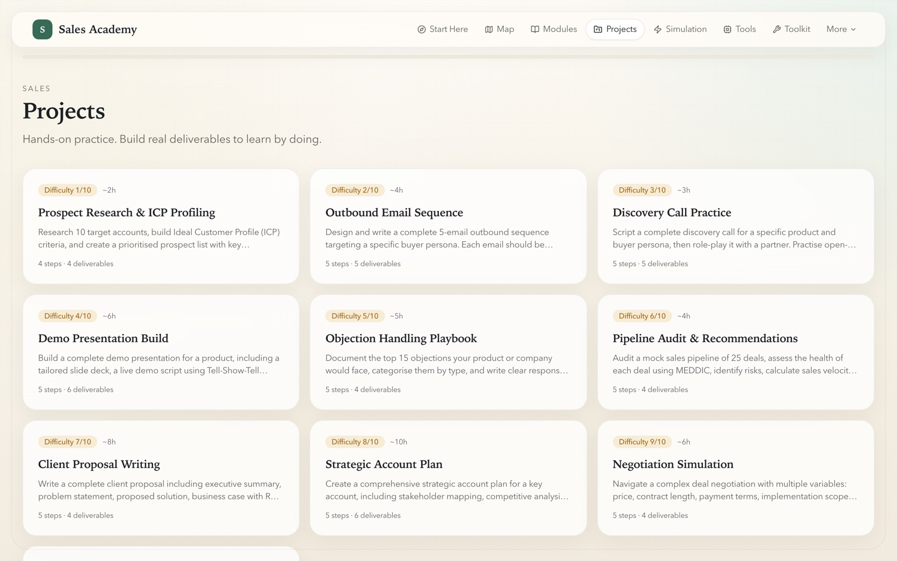
</p>

### 🎮 Interactive simulations

Marketing, Sales and AI Engineering ship branching simulations with scored decisions and mentor
feedback. In the marketing one you are hired as the first marketer at **Bloom & Co.**, a Melbourne
D2C skincare brand doing $420K a year, and you have $5,000 a month and a quarter to build an engine.

<p align="center">
  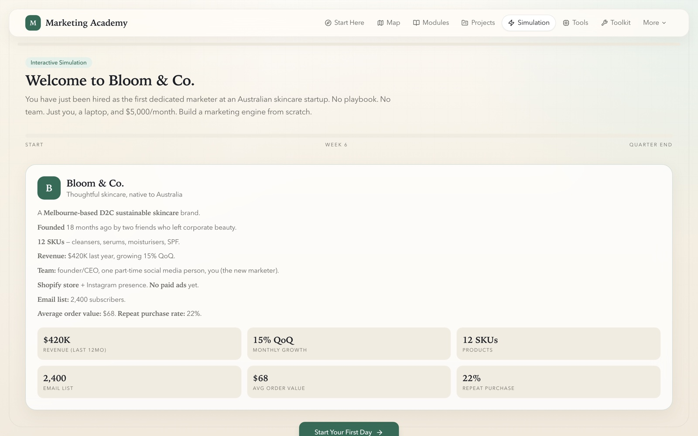
</p>

## 🔒 Privacy, by architecture

There is no privacy policy to read because there is nothing to disclose:

- **No accounts, no auth, no database, no API routes.** Zero `route.ts` files in the app.
- **No network calls.** Content is read from JSON on disk at build time.
- **No telemetry.** Your progress lives in `localStorage`, in your browser, and is never transmitted.
- **No configuration.** `.env.example` has exactly one variable and the app does not even read it.

`next.config.js` sets `X-Content-Type-Options: nosniff`, `X-Frame-Options: DENY` and
`Referrer-Policy: strict-origin-when-cross-origin`.

## 🧱 How it is built

```text
content/curriculum/{domain}/     ← 1,468 JSON files, the entire product
├── manifest.json                ← domain registration; the loader auto-discovers it
├── modules/  lessons/           ← the Learn track
├── playbooks/  systems/         ← the operator track
├── tools/  frameworks/          ← the reference track
├── projects/  day-in-life/      ← the practice track
└── domain-meta/                 ← operating rhythm

src/lib/content.ts               ← 35 loader functions, every one scoped by domain
src/types/curriculum.ts          ← Zod schemas; a malformed file fails the build
src/lib/progress.ts              ← Zustand + persist → localStorage only
```

**Adding a domain takes no code.** Drop `content/curriculum/{slug}/manifest.json` matching
`SubjectManifestSchema`, add JSON in the subdirectories, and the loader discovers it. Adding
content to an existing domain is the same move without the manifest.

Because every content file is validated by Zod at load time, a typo in a JSON file **fails the
build** rather than shipping a broken page.

## 🛠️ Tech stack

**Next.js 15.1** App Router · **React 19** · **TypeScript 5.7** (strict) · **Tailwind CSS 3.4** ·
**Framer Motion 12** · **Zustand 5** (persist) · **Zod 3.24** · **Radix UI** (7 primitives) ·
**lucide-react** · **three 0.183** + **@react-three/fiber 9.5** + **drei 10.7** for the
constellation map, kept behind `hidden md:block` so phones never pay for it.

~35,700 lines of TypeScript across 14 route patterns. Node >= 20.

```bash
npm run dev          # dev server
npm run build        # production build
npm run type-check   # tsc --noEmit
npm run lint         # eslint
npm run format       # prettier
```

## ⚠️ Honest status

This is an **internal-beta product built in the open**, and the gaps are worth stating plainly:

- **There is no automated test suite.** Zero test files, no test runner, no `test` script. The
  quality gates are `type-check`, `lint`, `build` and manual route smoke checks - nothing more.
- **There is no CI.** No `.github/` directory, so nothing runs on push. Every gate above is local
  and skippable.
- **Content depth is uneven** across the fifteen domains, as described above.
- **Sources are not cited per lesson.** Content draws on named public frameworks (MEDDIC, BANT,
  Sandler) and published research, but there is no per-claim citation layer.

Content is written in Australian English with AUD context throughout.

## 📄 Licence

No licence file is present, which under GitHub's terms means **all rights reserved** - you may view
this repository, but not reuse it. If you want to build on it, open an issue and ask.

---

<p align="center">
  <em>Founder OS - part of the Vivacity app portfolio.</em><br />
  <a href="https://vdapp32-founder-os.vercel.app">Live app</a> ·
  <a href="CLAUDE.md">Architecture notes</a> ·
  <a href="status/">Delivery status</a>
</p>
